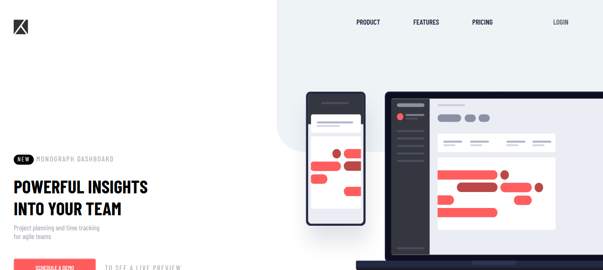
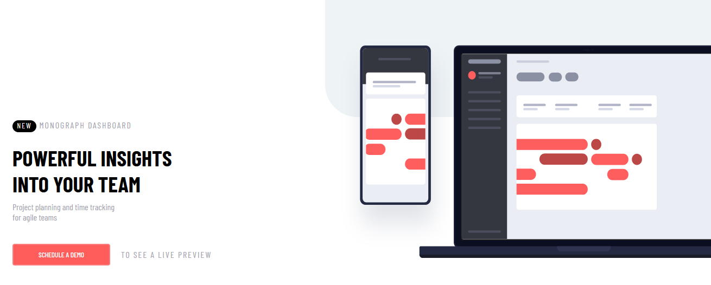
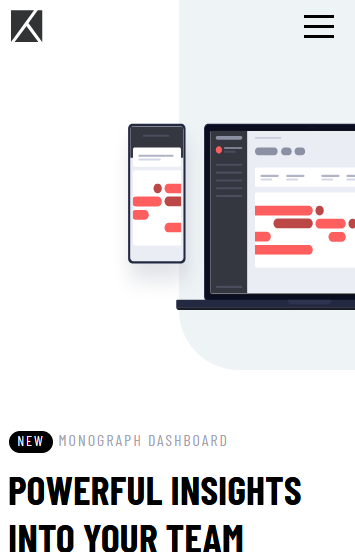
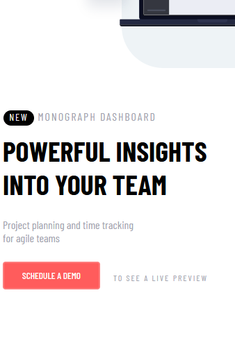
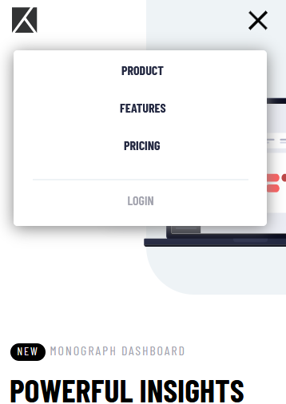

# Frontend Mentor - Profile card component solution

- This is a solution to the Profile card component challenge on Frontend Mentor.

## Screenshot

- fireShot desktop

##

##

- fireshot mobile
##

##

##

## Links

[solution](https://landpage-responsive.vercel.app/)

## Built with

> Semantic HTML5 markup
> CSS custom properties
> Flexbox
> CSS Grid

## Continued development
> Flexbox
> CSS Grid
> sass/scss
> javaScript

## Useful resources

[display grid](https://www.origamid.com/projetos/css-grid-layout-guia-completo/) - this helped me understand a little bit about display grid. I really liked this pattern and will use it going forward.

[menu hamburguer](https://youtu.be/i5Fps4GBBns) - this helped me understand a little bit about display grid. I really liked this pattern and will use it going forward.

[flexbox](https://www.origamid.com/curso/css-flexbox/) - This is an amazing article that finally helped me understand flexbox. I recommend it to anyone who is still learning this concept.

## Author

> Website - [marcos damasceno/linkedin](https://www.linkedin.com/in/marcos-damasceno-196b68175/)
> Frontend [Mentor - @marcosDmc](https://www.frontendmentor.io/profile/marcosDmc)
> Twitter - [@m_code](https://twitter.com/_m_code_)
> instagram - [@m_code](https://www.instagram.com/_m_code_/)
> instagram secondary - [@devaprendiz_](https://www.instagram.com/devaprendiz_/)
